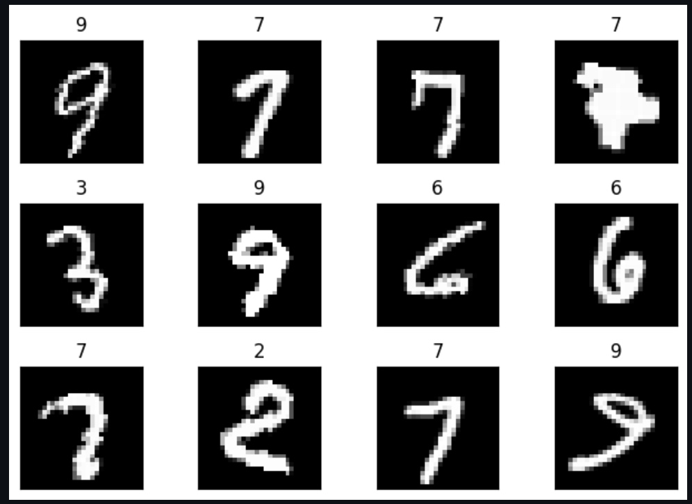
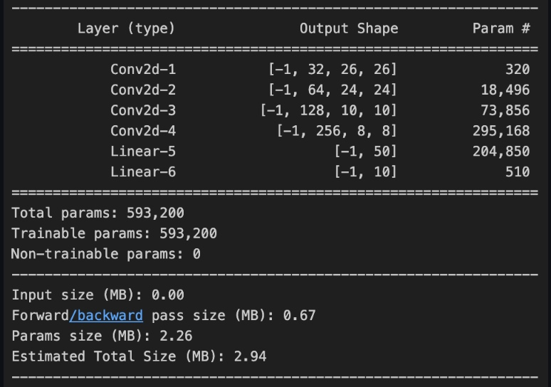
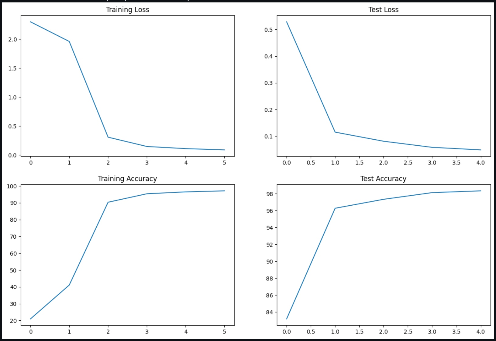

# Session 5 - Pytorch Tutorial

## Description

The project is focussed on training a small Convolutional model (8 layers) to learn from the MNIST dataset and predict on similar content.

## Usage

For training the model, you just need to run the `S5.ipynb` file. The model is defined in the `model.py` file, while the `utils.py` file contains
the ***train*** and ***test*** functions for the model training and testing respectively along with the auxiliary function ***GetCorrectPredCount***.

## Training Dataset

## Model Summary

## Training Results
The model was trained for 5 epoch, with the metrics plotted below.

